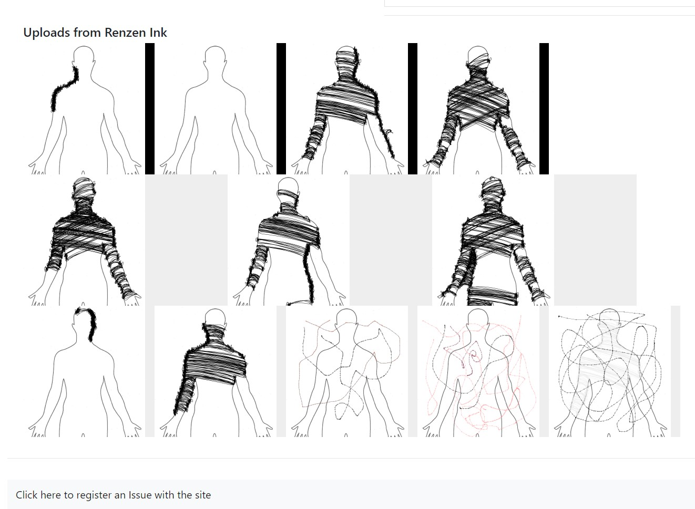

# renzen

[renzen.io](renzen.io)

## What is it?
Renzen is a project that combines a Java art application called Renzen Ink with the website Renzen.io. 

From Renzen Ink you can create artwork, and share it to your friends and communities on Renzen.io. It also allows "streaming works in progress" by allowing a user to add, at any time, a screenshot of their current work to an updated article on their profile and communities.

This allows artists in communities to work together and comment, appreciate, and support other artists throughout their entire artistic process and journey, rather than just uploading a finished product at the end.

The Renzen Ink app uses Spring boot to log into your online profile, and retrieve information about your online Renzen.io profile and personalize your experience. It allows a basic drawing experience at this time, to be further developed. It also has a special tool developed called "Caster" that allows the user quickly create strokes across an outline. More specialty tools like this are in the works. The UI was originally devloped in Swing, but has been ported to JavaFX. It is designed using MVC principles.

Renzen.io is built using Spring Boot on the backend. Microsoft Azure is used extensively to support the site. Azure App Services is used to host the web app, Azure Cosmos DB is used to store the information on the site, and Azure storage is used to store the images on the site. The front end of the website is built in Javascript using React, Bootstrap, and Redux.

## Website Homepage

The homepage allows you to sign up or login. It also has links to the github repository and a persisent bookmarks section that stays on every page. Also, on the bottom of the page is a list of recently created users, communities, and articles.

The focus of the site is on the tabbed way of navigating it. When researching, for example, you will be able to have all your information on one web page.
Soon to be added is the ability to open a set of articles as a saved group.

## Profile Page

On the profile page, once you're logged in, you can create new Communities or see the communities you are a part of, or articles you have written.
You can also see the screenshots from Renzen Ink that you've uploaded to your profile!

## Community Page

On the community page you can see what articles have been created in the community. Soon a community discussion page will be added as well.

## Create an article

Here you can write articles and divide them into sections

## Ariticle Page

Finally you can view articles and add bookmarks. Soon the ability to comment on articles will be added.

